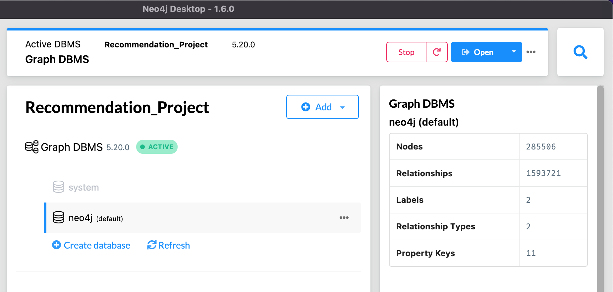
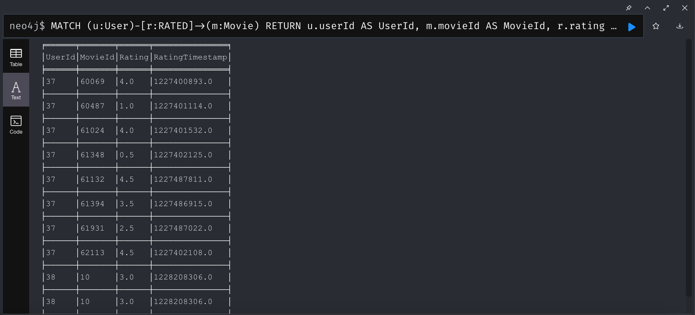
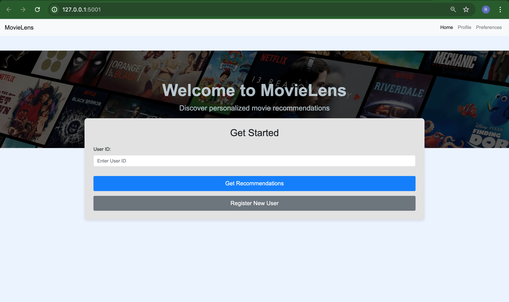
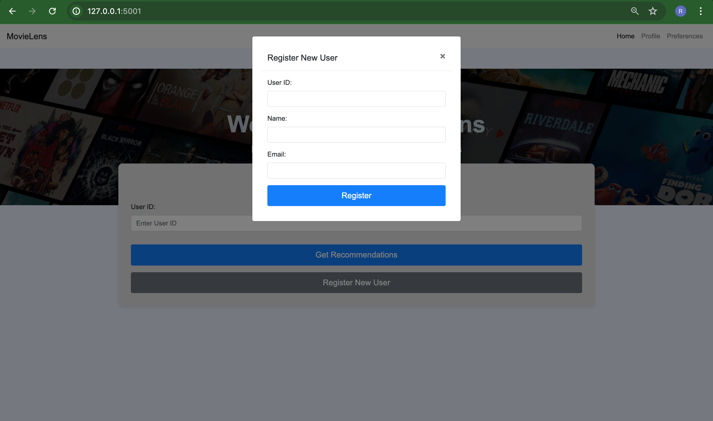
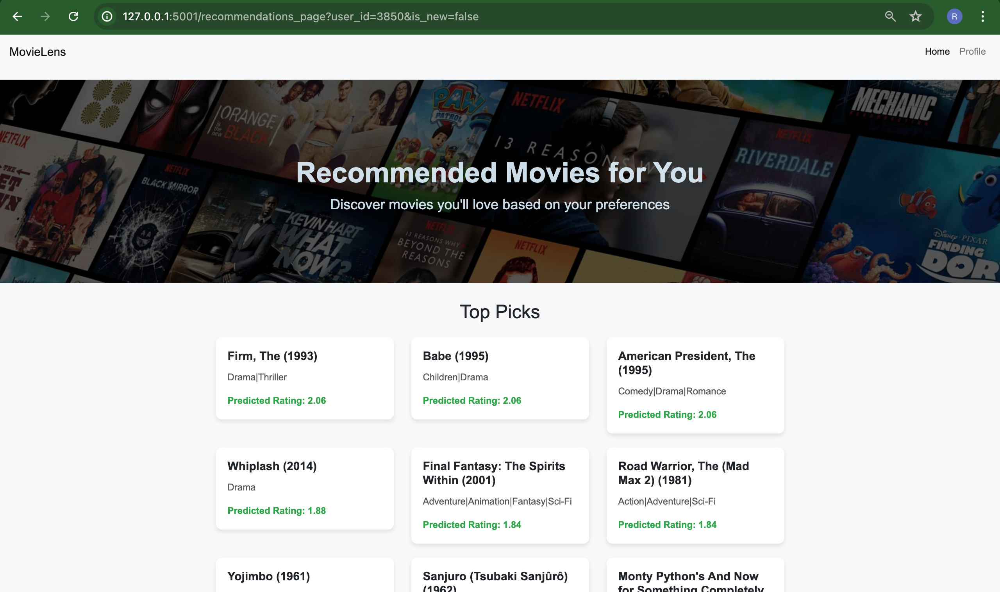
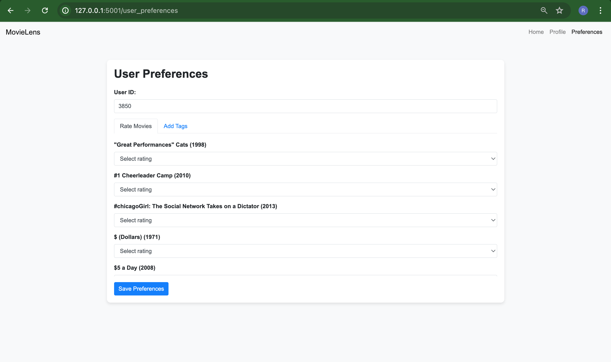
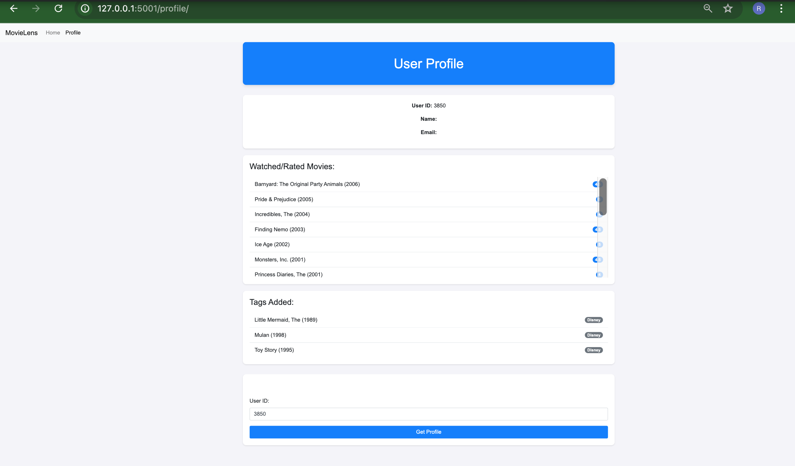

# Movie Recommendation Engine

This project aims to build a robust movie recommendation engine using Neo4j for graph-based data storage and processing. The data ingestion process is optimized and parallel processing to handle large datasets efficiently.

## Table of Contents

- [Overview](#overview)
- [Dataset](#dataset)
- [Environment Setup](#environment-setup)
- [Project Structure] (#project-structure)
- [Data Ingestion](#data-ingestion)
- [Usage](#usage)
- [Cold Start Recommendations](#cold-start-recommendations)

## Overview

The goal of this project is to create a movie recommendation engine that solves the cold start problem, similar to platforms like Netflix. The engine uses Neo4j to store and process relationships between users, movies, ratings, tags, and links.

## Dataset

The project uses the MovieLens dataset, which consists of the following files:

- `movies.csv`: Movie information (movieId, title, genres)
- `tags.csv`: Tags applied to movies by users (userId, movieId, tag, timestamp)
- `links.csv`: Mapping to external movie databases (movieId, imdbId, tmdbId)
- `ratings.csv`: Ratings given by users to movies (userId, movieId, rating, timestamp)

## Environment Setup

### Prerequisites

- Python 3.10+
- Neo4j 4.x+
- `python-dotenv` for environment variable management

## Project Structure
```
Recommendation Engine/
│
├── backend/
│   ├── __init__.py
│   ├── register.py
│   ├── profile.py
│   ├── user_check.py
│   ├── preferences.py
│
├── recommendations/
│   ├── __init__.py
│   ├── collaborative_filtering.py
│   ├── content_based.py
│   ├── hybrid.py
│   ├── cold_start.py
│   ├── utils.py
│   ├── recommend.py
│
├── static/
│   ├── image.jpg
│   ├── .........
│
├── templates/
│   ├── index.html
│   ├── profile.html
│   ├── recommendations.html
│   ├── user_preferences.html
│
├── app.py
├── .env
├── requirements.txt
└── ingest_data.py
```

### Installation

1. Clone the repository:
    ```bash
    git clone <repository-url>
    cd <repository-directory>
    ```

2. Create and activate a virtual environment:
    ```bash
    python3 -m venv venv
    source venv/bin/activate  # On Windows, use `venv\Scripts\activate`
    ```

3. Install the required Python packages:
    ```bash
    pip install -r requirements.txt
    ```

4. Create a `.env` file in the root directory of the project and add the following content:
    ```env
    MOVIES_PATH=data/movies.csv
    TAGS_PATH=data/tags.csv
    LINKS_PATH=data/links.csv
    RATINGS_PATH=data/ratings.csv

    NEO4J_URI=bolt://localhost:7687
    NEO4J_USERNAME=neo4j
    NEO4J_PASSWORD=password
    NEO4J_DATABASE=neo4j
    ```

5. Start your Neo4j database and make sure it is accessible via the credentials provided in the `.env` file.

## Data Ingestion

To ingest the data into the Neo4j database, run the `ingest_data.py` script. This script will read the datasets, creating nodes and relationships in Neo4j.

### Run the Ingestion Script
```bash
python ingest_data.py
```

### Verify Graph DBMS after ingestion


### Verify data after ingestion, e.g.



## Usage
#### Running the Application
To start the Flask application, run the `app.py` script. This will start the web server on http://127.0.0.1:5001.
``` 
python app.py
```

### Accessing the Application
Open your web browser and navigate to http://127.0.0.1:5001 to access the application. You can register new users and get movie recommendations.

### Registering a New User
To register a new user, click on the "Register New User" button, fill in the user ID, name, and email, and submit the form.






### Getting Recommendations
To get movie recommendations, enter the user ID in the input field and click on "Get Recommendations".

*Note:* 
- If the user has less than around 4 or 5 preferences, then it would not recommend any top picks for that users. Watched/Rated movies should be at least 8 items. For that particular user, it needs to go to the `Preferences` tab to add ratings/tags further.

- If the user has just registered now and completely new, there would be no preferences or watched movies, then it will use the Cold Start algorithm for those particular users



### User Preferences


### User Profile



## Cold Start Recommendations
For new users with no prior interactions, the system will apply a cold start algorithm to generate recommendations. These recommendations are based on popular, trending, and diverse movies to provide a good starting point for new users.

## Acknowledgments
- *MovieLens*: For providing the dataset.
- *Neo4j*: For the graph database platform.
- *Flask*: For the web framework.
